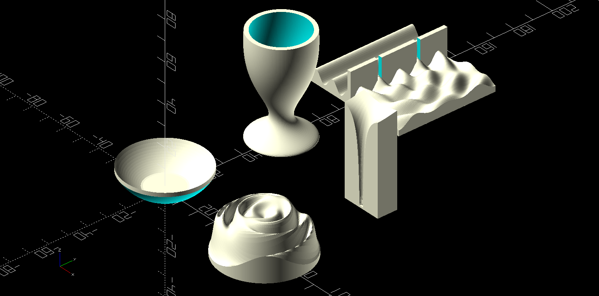

# OpenSCAD Function Plotting Library

<p align="center"></p>

This is a general purpose function plotting library for OpenSCAD which will
render functions with Cartesian coordinates (x & y input, z output),
polar/cylindrical coordinates (r & angle input, z output), or axial coordinates
(z & angle input, r output). This library is sufficiently flexible that it can
be used for more than just plotting functions. As demonstrated in the included
demo files, this can efficiently render ordinary objects with surfaces defined
by mathematical functions.

While there are a few other function plotting libraries out there for OpenSCAD,
this one is particularly robust, fast, and flexible. It uses list comprehension
to generate each plot as a single polyhedron, supports multiple user-defined
functions of each type in one design, consistently creates properly manifold
renders, and executes as quickly as any other rendered object of comparable
size.

# Usage

## New call modality - Function literals

With function literals being stable since the 2021 release of OpenSCAD, one can
pass function variables into the plotting functions.  With this call modality,
plot_function.scad can be utilized with either 'use' or 'include'.  For
example, the following code will create a Cartesian coordinate plot of the
function DemoFunc over the domain -40 through 40 in both x and y with a
step size of 0.4:

```
use <plot_function.scad>
DemoFunc = function(x, y) 2*(1.5 + cos(x*x + y*y/4));
PlotFunction(DemoFunc, [-40, 0.4, 40], [-40, 0.4, 40]);
```


## Old call modality - Hardcoded function names

Since OpenSCAD used to not support passing functions as parameters, this
library for compatibility still supports an older calling mode, allowing the
user to declare functions Func1, Func2, etc, PolarFunc1, PolarFunc2, etc, and
AxialFunc1, AxialFunc2, etc. Then the number 1, 2, etc is passed to the
corresponding plot routine. For example, the following code will create a
Cartesian coordinate plot of the following function #1 over the domain -40
through 40 in both x and y with a step size of 0.4:

```
include <plot_function.scad>
function Func1(x, y) = 2*(1.5 + cos(x*x + y*y/4));
PlotFunction(1, [-40, 0.4, 40], [-40, 0.4, 40]);
```

The module call PlotFunction can occur anywhere a normal polyhedron could be
generated, but the function definition Func1 must be declared at the top-level
of the code so that it can be accessed from within the included plotting
library. Note that it must "include" plot_function.scad rather than "use" it,
for the old modality, so that Func1 and others are accessible.

## Full API

A variety of usage demonstrations are in the demo_plot_function.scad file,
and the API for the three plotting modules is as follows:

```
// Plots either a function literal or the numbered function Func1 through
// Func9, where FuncN is either the function literal or the number 1 through 9.
// Each function is a function of x and y.
// minx_stepx_maxx should be [minx, stepx, maxx], and likewise for y,
// specifying the domain to be plotted.
// To guarantee a properly manifold shape, the routine will only render
// strictly positive values (z>0) of the defined function.  Add an offset if
// needed to achieve this.
module PlotFunction(FuncN, minx_stepx_maxx, miny_stepy_maxy)

// Plots either a function literal or the numbered function PolarFunc1 through
// PolarFunc9, where PolarFuncN is either the function literal or the number 1
// through 9.  Each function is a function of radius and angle.
// max_r is the outer radius, and min_step is the smallest step size between
// points.
// To guarantee a properly manifold shape, the routine will only render
// strictly positive values (z>0) of the defined function.  Add an offset if
// needed to achieve this.
module PlotPolarFunction(PolarFuncN, max_r, min_step=-1)

// Plots either a function literal, or the numbered function AxialFunc1 through
// AxialFunc9, where AxialFuncN is either the function literal or the number
// 1 through 9.  Each function is a function of z-height and angle, and returns
// the radius outward in the xy-plane.
// max_r is the outer radius, and min_step is the smallest step size between
// points.
// minz_stepz_maxz should be [minz, stepz, maxz], and likewise for y,
// specifying the domain to be plotted.
// To guarantee a properly manifold shape, the routine will only render
// strictly positive values (r>0) of the defined function.  Add an offset if
// needed to achieve this.
module PlotAxialFunction(AxialFuncN, minz_stepz_maxz, num_circle_steps=360)
```

# How it works internally

This section does not need to be read or understood to use the library. The key
step in the design relies on the PlotClosePoints module which generates an
arbitrary polyhedron given a two-dimensional array of points defining a series
of consecutive loops outlining the polyhedron. This provides clear guarantees
of producing a manifold shape as long as the outlining points are kept properly
ordered by the Plot modules. The axial plots are then defined by loops from z=0
to the max height, with the radial distance outward of each point given by the
provided function. The Cartesian plots are done similarly, but starting from
the minimum y value, including 2 coordinate values for the bottom corners at
the x max and x min, and looping across the x values. The polar plots start
with the bottom outer ring and loop inward with consecutive rings for each
radial value of the polar part, with the loops adopting whatever z value the
provided function gives.

